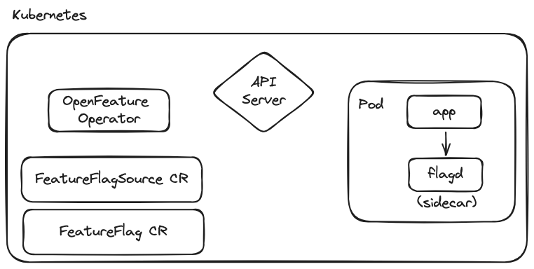

# Lab03

[OpenFeature operator](https://github.com/open-feature/open-feature-operator/)

Using flagd as sidecar



Create kind cluster

```
kind create cluster --config kind-cluster-quick-start.yaml
```

Show cluster info with `kubectl`

```
kubectl cluster-info
```

Install Cert-Manager

```
kubectl apply -f https://github.com/cert-manager/cert-manager/releases/download/v1.13.2/cert-manager.yaml && \
kubectl wait --timeout=60s --for condition=Available=True deploy --all -n 'cert-manager'
```

Install OpenFeature operator (by helm)

```
helm repo add openfeature https://open-feature.github.io/open-feature-operator/ && \
helm repo update && \
helm upgrade --install open-feature-operator openfeature/open-feature-operator
```

Load image build from lab02

```
kind load docker-image lab02-app:latest
```

Apply flag yaml

```
kubectl -n default apply -f flag.yaml
```

Apply app yaml

```
kubectl -n default apply -f app.yaml
```

Get the custom resource (CRs)

```
kubectl get FeatureFlag
```

```
kubectl get FeatureFlagSource
```

Visit http://localhost:30000/ping

Change flag.yaml and apply `flag.yaml` again

Visit http://localhost:30000/ping

Clear the resource

```
kind delete cluster
```
